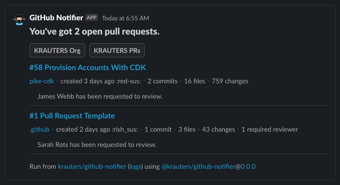

<div align="center">

<a href="https://www.linkedin.com/in/coltenkrauter/" target="_blank"></a>

[](https://github.com/marketplace/actions/github-notifier-by-krauters)


[](https://www.npmjs.org/package/@krauters/github-notifier)


[](https://packagephobia.now.sh/result?p=@krauters/github-notifier)


</div>

# GitHub Notifier

Post Open Pull Requests to Slack.



[Simple Usage Example](https://github.com/krauters/github-slack-notifier)

**GitHub Notifier** is a _TypeScript_ [GitHub Action](https://docs.github.com/en/actions) that posts open pull requests to Slack channels based on a [scheduled job](https://crontab.guru/) to remind team members to review pull requests.

## Overview

This _GitHub Action_ will query the GitHub (or GitHub Enterprise) org for all repositories (based on token permissions) and then, for each repository it will check for open pull requests. Then, it will attempt to match any related GitHub users to Slack users before building [Slack blocks](https://app.slack.com/block-kit-builder/T025EE5RS#%7B%22blocks%22:%5B%5D%7D) and posting a message (or multiple messages in the case of many PRs) to the designated Slack channels. 

## Quick start

1. (Optional) Create a repository called `github-notifier`
    1. Whatever repository that you use to host this workflow template must be able to use GitHub Runners.
1. [Create a GitHub token](https://github.com/settings/tokens?type=beta)
    ```md
    // GitHub Token requirements

    Fine grained Github token with scopes for **all repositories** (Or a subset of repositories that you want included in the notification),
    - (Resource Owner should be the org that contains the pertinent repositories/pull-requests – Requires an org owner to create it)
    - (Repository) Administration:read (to list all repos in org)
    - (Repository) Pull Requests:read (to get PR details for repos)
    - (Repository) Contents:read (to get branch protections)
    - (Organization) Members:read on all repos (to get GitHub email for Slack user matching)
    ```
    1. Save the token value to the repository > `Settings` > `Secrets and variables` > `Actions` > `New repository secret` with suggested name **GH_TOKEN_GH_NOTIFIER**
1. [Create a Slack App](https://api.slack.com/apps) _from scratch_ with the name `GitHub Notifier` (ex: `GitHub Notifier`) and add it to your Slack workspace.
    1. On the **OAuth & Permissions** page, add scopes,
    ```md
    Bot User OAuth Token with the following bot token scopes,
    - chat:write (to post message to Slack channels)
    - users:read (to get user information for GitHub user matching)
    - users:read.email (to get user emails for GitHub user matching)
    - chat:write.customize (to allow the bot to customize the name and avatar)
    ```
    1. On the **OAuth & Permissions** page, `Install To Workspace` and then copy the `User OAuth Token`
    1. Save the token value to the repository > `Settings` > `Secrets and variables` > `Actions` > `New repository secret` with suggested name **SLACK_TOKEN_GH_NOTIFIER**
    1. Add the Slack app that you created to the pertinent Slack channel/s and grab the channel id/s for the workflow.
1. Create a workflow similar to the following,
    ```yaml
    # .github/workflows/github-notifier.yaml

    name: GitHub Notifier

    on:
      schedule:
      - cron: "0 15,17,19,21,23 * * 1-5"
        workflow_dispatch:

    jobs:
      github-notifier:
        runs-on: ubuntu-latest
        steps:
        - uses: krauters/github-notifier@main
          with:
            github-token: ${{ secrets.GH_TOKEN_GH_NOTIFIER }}
            channels: C07L8EWB389
            slack-token: ${{ secrets.SLACK_TOKEN_GH_NOTIFIER }}
            with-drafts: true
    ```
    To better understand the available inputs, you can check the [action definition file, action.yaml](./action.yaml).

## Troubleshooting

```
Error: An API error occurred: channel_not_found
```

This error indicates that you likely didn't add the Slack App that you made to the Slack channel

## Husky & Pre-Commit Hooks

Husky simplifies Git hooks management, automating tasks like code checks before a commit. It's set up to run specified commands (like tests or lints) pre-commit, ensuring code quality and consistency.

Pre-commit hooks are automated scripts that run before each commit is completed, designed to catch errors or enforce project standards. With Husky, setting up and managing these hooks across the team is straightforward, helping maintain a clean codebase.

### Our Custom Pre-Commit Hook

This project uses a custom pre-commit hook to run `npm run bundle`, ensuring that our bundled assets are always up to date before a commit (this is required for TypeScript GitHub Actions). By automating this with Husky, we ensure that no commit goes through without a fresh bundle, maintaining the integrity and efficiency of our codebase.

## Contributing

The goal of this project is to continually evolve and improve its core features, making it more efficient and easier to use. Development happens openly here on GitHub, and we’re thankful to the community for contributing bug fixes, enhancements, and fresh ideas. Whether you're fixing a small bug or suggesting a major improvement, your input is invaluable.

## License

This project is licensed under the ISC License. Please see the [LICENSE](./LICENSE) file for more details.

## 🥂 Thanks Contributors

Thanks for spending time helping this project mature.

<a href="https://github.com/krauters/github-notifier/graphs/contributors">
  
</a>
